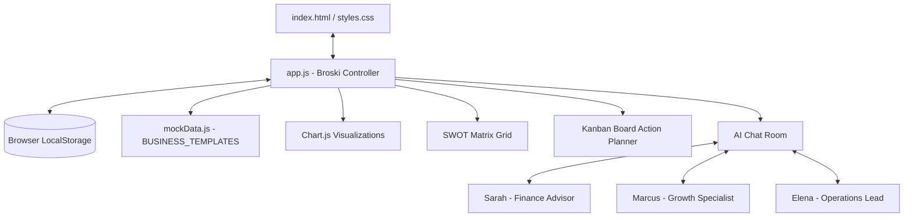
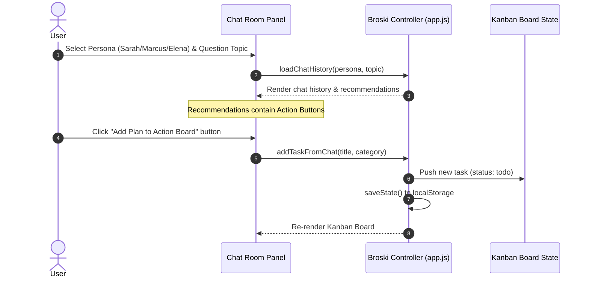
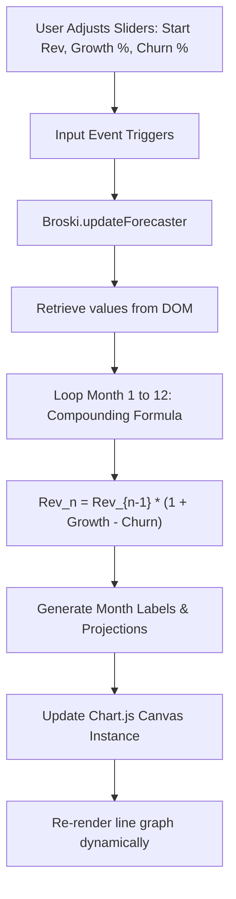

# Broski - AI Business Analyst Assistant

Broski is a sophisticated, interactive client-side web application designed to help business owners, startup founders, and analysts simulate scenarios, consult specialized AI agent personas, maintain strategic SWOT matrices, and construct actionable project task lists. 

With its premium glassmorphic interface, dark theme support, and dynamic visualization widgets, Broski acts as a single-page cockpit for business intelligence and strategic planning.

---

## 🏗️ System Architecture & Data Flow

Broski is built as a modular client-side application. The application state, view routing, visual charts, and model logic are controlled by a centralized controller class (`Broski`) implemented in `app.js`.

### 1. High-Level Component Architecture
This diagram outlines how the user interface components communicate with the central controller, state cache, local storage, and static mock database.



### 2. AI Chat-to-Action Planner Workflow
When consulting the AI expert personas, recommendations are delivered with actionable tasks. Users can instantly add these recommendations to their Kanban Board with a single click.



### 3. Compound Revenue Forecaster Workflow
The Forecaster panel computes compounding growth and churn over a 12-month horizon. It updates the dynamic linear projection in real-time as users modify the inputs.



---

## 🌟 Core Features

### 📊 Executive KPI Dashboard
* **Dynamic Business Templates**: Seamlessly swap between three business templates:
  * **SaaS Platform (CloudScale)**: Focuses on MRR, User Churn, LTV, CAC, and LTV:CAC ratios.
  * **E-Commerce Store (LuxeDecor)**: Tracks Gross Revenue, Conversion Rates, Average Order Value (AOV), and Abandonment rates.
  * **Local Cafe & Retail (UrbanBites)**: Tracks Daily Sales, Foot Traffic, Average Ticket, and Repeat Customer Rate.
* **Interactive Metric Customizer**: Adjust core KPIs manually to simulate custom analytical dashboards.
* **Rich Data Visualizations**: Interactive graphs built with **Chart.js** displaying monthly revenue trends and acquisition channels (Search, Content, Referrals, etc.).

### 💬 AI Operations Chatroom
* **Three Dedicated Experts**:
  * **Sarah (Financial Analyst)**: Provides cash flow, margin optimization, and unit economics recommendations.
  * **Marcus (Growth Specialist)**: Recommends organic growth loops, channel expansions, and marketing strategies.
  * **Elena (Operations Lead)**: Advises on process automation, onboarding optimization, and customer service workflows.
* **Context Preservation**: Chat histories and responses are preserved per template and per persona, so you never lose context when switching dashboards.
* **Actionable CTA Integration**: Recommendation logs contain embedded "Add to Action Board" buttons to bridge the gap between strategic advice and execution.

### 📈 Compound Revenue Forecaster
* **Real-time Projections**: Drag sliders to customize starting revenue, projected monthly growth rate, and monthly churn rate.
* **Compounding Formula**: Computes monthly compound projection using:
  $$\text{Revenue}_{t} = \text{Revenue}_{t-1} \times \left(1 + \frac{\text{Growth \%} - \text{Churn \%}}{100}\right)$$
* **Visualization Layer**: Plots the next 12 months in a premium gradient-filled line chart.

### 📝 Strategic SWOT Analysis Matrix
* **Quadrant-based Matrix**: Organize business insights into **Strengths**, **Weaknesses**, **Opportunities**, and **Threats**.
* **Interactive CRUD**: Dynamically add and delete items in any quadrant.
* **Template Sync**: SWOT grids automatically load defaults specific to SaaS, E-Commerce, or Cafe/Retail models.

### 📋 Decision Action Planner (Kanban Board)
* **Status Columns**: Visual lanes for **Backlog**, **In Progress**, and **Completed** tasks.
* **Multi-channel Control**: Move cards between columns using either drag-and-drop actions or built-in navigation buttons (ideal for mobile and accessibility).
* **Category Tagging**: Tasks are color-coded and tagged by departments (Marketing, Finance, Operations, Product, Research).

### 💾 LocalStorage State Persistence
* All configurations, custom KPIs, edited SWOT items, Kanban tasks, active themes, panel views, and conversation logs are synchronized locally in your browser's `localStorage` under the key `broski_app_state`.

---

## 🚀 Getting Started

Broski is a client-only static application. It requires no database setup, package managers, or server runtimes to get started.

### Prerequisites
* A modern web browser (Google Chrome, Firefox, Edge, Safari).
* An active internet connection (to load Google Fonts and Chart.js via CDN).

### Installation
1. **Clone the Repository**:
   ```bash
   git clone https://github.com/varun8178/broksi.git
   cd broksi
   ```

2. **Open the App**:
   Simply double-click the `index.html` file in your file explorer to launch the app directly in your browser.

### Running with a Local Server (Recommended)
To run the app on a local port, you can use any static server extension or utility.

* **Using VS Code Live Server**:
  * Install the **Live Server** extension.
  * Click **Go Live** at the bottom right corner of VS Code.

* **Using Node.js (`npx`)**:
  ```bash
  npx serve .
  ```

* **Using Python**:
  ```bash
  python -m http.server 8000
  ```
  Open `http://localhost:8000` in your web browser.

---

## 🛠️ Codebase Structure

The codebase is organized as a lightweight, modular static web application:

```
├── index.html       # Single-page shell, templates layout, and modal structures
├── styles.css       # Custom design system, CSS variables, glassmorphic effects, and theme styles
├── app.js           # Core Broski controller class, state management, and event bindings
├── mockData.js      # Business templates, KPI default states, and AI expert responses
└── .gitignore       # Git exclusion definitions
```

### Key Technical Details

#### 🎨 Design System (`styles.css`)
Broski uses a comprehensive set of CSS variables to implement dark and light theme palettes. 
* **Dark Mode colors**: Uses deep charcoal backgrounds (`#0a0b10`), rich translucent borders (`rgba(255, 255, 255, 0.08)`), and neon indigo/purple accent highlights.
* **Light Mode colors**: Switches to clean slate grey, muted white surfaces (`rgba(255, 255, 255, 0.7)`), and high-contrast text tags.
* **Glassmorphism**: Enhanced depth is achieved using `backdrop-filter: blur(12px)` and custom drop shadows (`box-shadow: 0 8px 32px 0 rgba(0, 0, 0, 0.37)`).

#### 🎛️ State Controller (`app.js`)
The `Broski` class contains the core lifecycle methods:
* `init()`: Binds event handlers, loads cached states, initializes charts, and runs the initial render.
* `loadTemplateState(templateKey)`: Loads custom template variables and configures UI sliders.
* `addTaskFromChat(title, category)`: Bridging function called from inside simulated AI response buttons.
* `renderAll()`: Batched UI rendering to keep the DOM synced with state changes efficiently.

---

## 📈 Development & Customization Guide

### How to add a new Business Template
To add a new business template (e.g., "Agency" or "Real Estate"), edit [mockData.js](file:///c:/Users/varun/Desktop/The%20Capstone/mockData.js) and add a new entry to the `BUSINESS_TEMPLATES` object:

```javascript
const BUSINESS_TEMPLATES = {
  // Existing templates...
  agency: {
    name: "Consulting Agency",
    type: "agency",
    kpis: {
      primary: { label: "Monthly Retainer Value", value: "$30,000", trend: "+5% MoM", isPositive: true },
      secondary1: { label: "Client Utilization Rate", value: "85%", trend: "Good Health", isPositive: true },
      // Add other KPIs...
    },
    charts: {
      revenue: {
        labels: ["Jan", "Feb", "Mar", "Apr", "May", "Jun"],
        datasets: [{ label: "Retainer Value ($)", data: [25000, 26000, 27500, 28000, 29000, 30000], borderColor: "#6366f1", fill: true }]
      },
      channels: {
        labels: ["Referrals", "LinkedIn", "Upwork", "Cold Email"],
        data: [50, 25, 15, 10],
        colors: ["#6366f1", "#a855f7", "#ec4899", "#f59e0b"]
      }
    },
    swot: {
      strengths: ["High client retention", "Expert specialized niche"],
      weaknesses: ["Founders are bottleneck for scaling", "Lumpy client acquisition"],
      opportunities: ["Productize consulting services", "Hire junior account executives"],
      threats: ["Platform risk on LinkedIn", "Economic downturn reducing client budgets"]
    },
    kanban: [
      { id: "a-t1", title: "Standardize client onboarding doc", description: "Create an onboarding template to delegate tasks.", status: "todo", category: "Operations" }
    ],
    chatResponses: {
      retention: {
        Sarah: "Sarah's customized advice for agencies...",
        Marcus: "Marcus's customized advice for agencies...",
        Elena: "Elena's customized advice for agencies..."
      },
      marketing: {
        Sarah: "Finance marketing advice...",
        Marcus: "Growth marketing advice...",
        Elena: "Operations marketing advice..."
      }
    }
  }
}
```

Next, add the corresponding option in the template selector dropdown inside `index.html`:
```html
<select id="templateSelector" class="template-select" onchange="app.handleTemplateChange(this.value)">
  <option value="saas">SaaS Platform (CloudScale)</option>
  <option value="ecommerce">E-Commerce Store (LuxeDecor)</option>
  <option value="retail">Local Cafe & Retail (UrbanBites)</option>
  <option value="agency">Consulting Agency</option> <!-- Added -->
</select>
```

Add initialization rules inside `loadTemplateState` in `app.js` to set default slider levels when the template is selected.

---

## 📄 License
This project is open-source and available under the MIT License.
